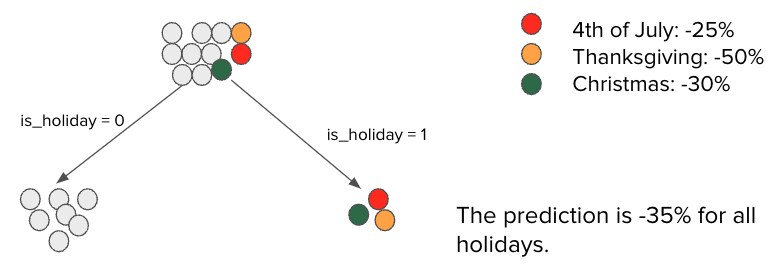
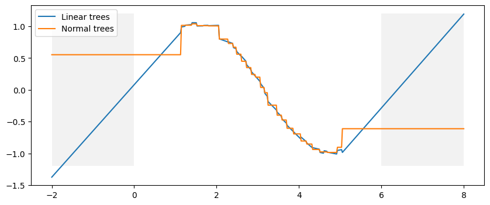

We use a **gradient boosting machine (GBM)** model to generate our forecasts across thousands of starting points.
forecast accuracy dips around rare extreme events such as holidays. . To improve accuracy around these events, we adopted a cascade modeling approach which extends the GBM with a linear model to handle the holiday’s impact.

## Limitations
- Tree-based models such as **random forest and gradient boosting** are popular in industry for their ease of use and high accuracy. 
  - For time-series forecasting in particular, these models capture excellent seasonality with appropriate feature encoding, handling non-linearities and, most importantly, avoiding overfitting. 
- These strengths, however, make it **challenging to handle anomalies and high variation**. 
  - In particular, tree-based models **fail to capture high variation during holiday**s even with one-hot encoding  because each holiday only appears once a year
  
    Refer this image for example:
  
The figure shows how a tree assigns different root node observations to its final nodes, or leaves, when trying to minimize the loss function and avoid overfitting

    <details>
    <summary>Exaplaination</summary>

    Assume that our dataset contains holiday observations, represented by colored dots, where order volume decreases in large amounts — for instance, a 50% decline on Thanksgiving Day when compared to regular days, shown as gray dots. When we train the model to minimize the loss function and avoid overfitting simultaneously, the extreme observations will end up under the same final node. In this scenario, the prediction for a holiday will be a simple average of all holidays in the final node (i.e., -35%), which generates a significant error of -10% for the Fourth of July holiday and +15% for Thanksgiving. In other words, we over-forecast for the Fourth of July and Christmas, while under-forecasting for Thanksgiving.
    </details>

- These models struggle with trend extrapolation due to the inherent design of tree-based methods. Although they are great at capturing patterns in the data, they falter when it comes to projecting these patterns into the future.

  
  <details>
  <summary>Core issue</summary>
    Tree-based models split the data into branches and leaves based on the values of the input features. These splits are made to optimize some criteria, such as reducing the <b>Gini impurity for classification</b> tasks or minimizing the <b>mean squared error for regression</b> tasks. Each leaf node then makes a prediction based on the average target value (for regression) or the majority class (for classification) of the training samples that fall into that leaf.<br><br>

    The limitation arises because these models are **inherently local**; their predictions are based on the specific instances within the training data that populate the leaves. If a new instance arrives with feature values outside the range seen during training, the model will apply the prediction of the nearest leaf node. It has no mechanism to infer trends or patterns beyond the bounds of the training data, making true extrapolation impossible.
  </details>

### 3. Strategy to resolve Challenge of Trend Extrapolation in Time series

#### 3.1. Strategy1: De-Trending the Time Series
- One way to forecast a time series is by removing the trend component from the original series, estimating it using a separate model or method, and then adding it back to the predictions. This process is called de-trending.

  ##### Pros and Cons
  **Pros**: This method is straightforward and allows for a clearer analysis of the data’s cyclical and seasonal patterns without the overshadowing effect of the trend.
  
  **Cons**: The effectiveness of de-trending heavily relies on the accuracy of the trend estimation method. Incorrect trend estimation can lead to loss of information and inaccuracies in the forecast.

#### Implementation via De-trending with a Linear Model and Loess Estimation.
[Link to Notebook](./experiment_with_real_data_strategies_1.ipynb)

#### 3.2 - Strategy 2: Differencing the Time Series
 - Differencing is a statistical technique that transforms a time series into a stationary one. It involves calculating the difference between consecutive observations in the time series. The goal of this process is to help stabilize the series' mean and reduce trends and seasonality, which can make it difficult to analyze and model the data. By taking the difference between two consecutive observations, we can remove the trend component of the series, making it easier to identify patterns and make predictions.

   ##### Pros and Cons
    **Pros**: It’s a simple approach to make the series more stationary, thus easier for tree-based models to handle.

    **Cons**: Differencing can lead to information loss, and excessive differencing might randomize the series, making it harder to model.

   #### Implementation via diff()(Moving Average)
    [Link to Notebook](./experiment_with_real_data_strategies_2.ipynb)

#### 3.3 - Strategy 3: Using the Linear Tree Method
 - For boosting models, integrating a linear component into the tree-building process can allow the model to capture both linear and non-linear patterns, offering a way to include trend extrapolation capabilities.

   ##### Pros and Cons
   **Pros**: It allows the model to extrapolate trends without transforming the target variable directly, capturing a broader range of patterns in the data.

   **Cons**: This approach is specific to certain models and can increase the model’s complexity and memory requirements.
    #### Implementation via lightgbm(), linear_tree enabled
    [Link to notebook](./experiment_with_real_data_strategies_3_lightgbm.ipynb)

### Installation dependency

#### MAC
 - ```brew install libomp```
 - From home directory: ```pip install -r Requirements.txt```

